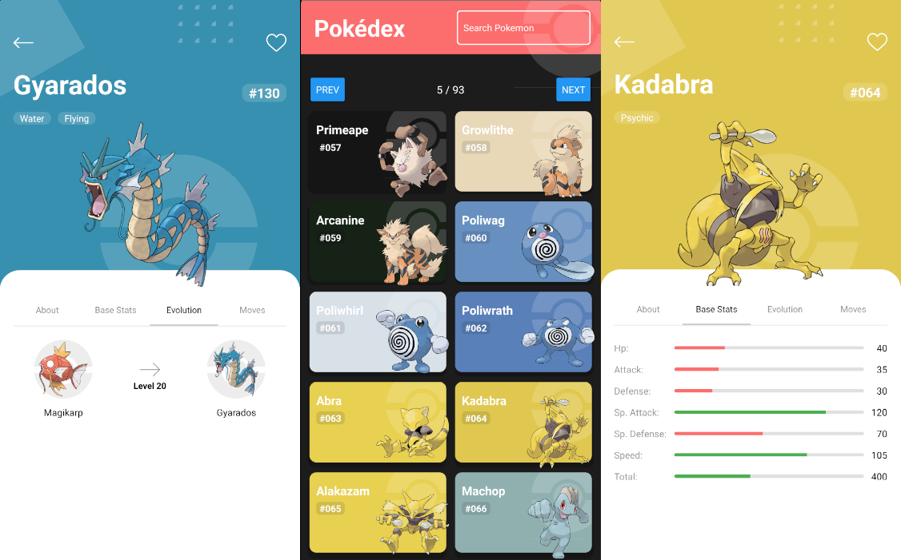

  

An interactive and modern Pokemon application built with React Native.

## Table of Contents
1. [Introduction](#introduction)
2. [Preview](#preview)
3. [Features](#features)
4. [Environment Setup](#environment-setup)
5. [Installation](#installation)
6. [Running the App](#running-the-app)
7. [Credits](#credits)
8. [License](#license)

## Introduction

Plantpedia aims to be an engaging application for exploring and learning about Pokemon. With features like pagination and search functionality, users can easily traverse through thousands of Pokemon data points.

## Preview

## Features

- A comprehensive list of Pokemons.
- Pagination support for easy navigation.
- Search functionality to find specific Pokemons.
- Detailed view of each Pokemon.

## Environment Setup

Before starting with the project, make sure to configure the development environment for React Native. Refer to the official [React Native Environment Setup Guide](https://reactnative.dev/docs/environment-setup) for instructions.

## Installation

1. Clone or download the project repository.
2. Run the command `yarn install` to install all the necessary dependencies.
3. Set the backend URL (`baseUrlPokeAPI`) in `src/app/pokeapi.tsx`. If you are running your backend server locally, use services like [ngrok](https://ngrok.com/) for global exposure.

## Running the App

Inside the root directory of your project, execute the following commands:

1. Start Metro Bundler: `yarn start`
2. Launch the app on an emulator or device: `yarn android`

## Credits

We make use of data provided by [PokéAPI](https://pokeapi.co). All information displayed in the app is obtained from this API.

  

